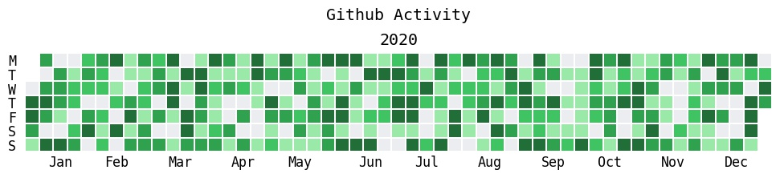
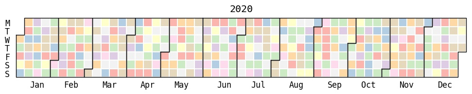
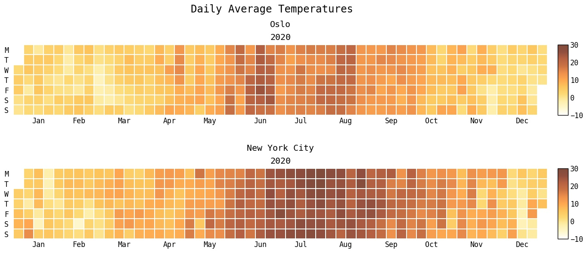
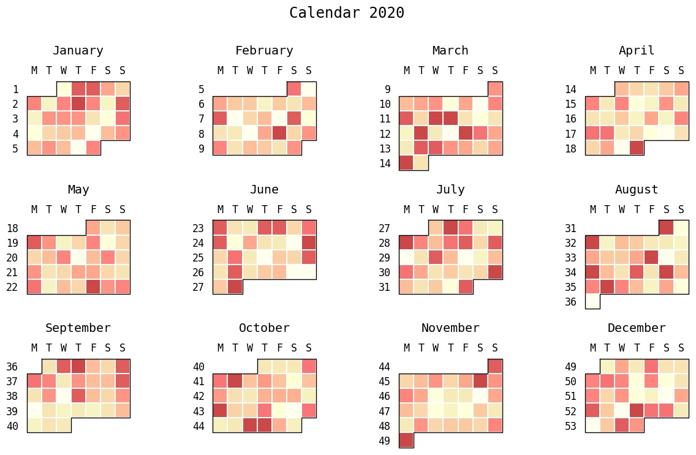
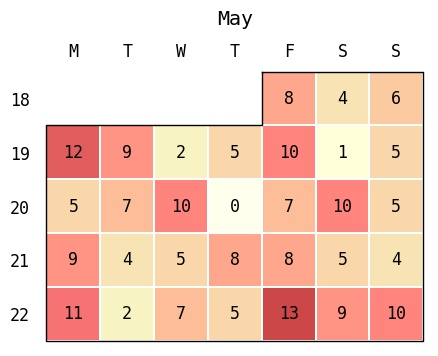

# July
A small library for creating beautiful heatmaps of daily data. 

### Features
- Get rid of the overhead and matplotlib tweaking every time you want to plot data in calendar format.
- Generate GitHub activity overview-like plots of your daily data.
- Plot daily data in calendar format (month or year).
- Automatic handling of missing dates in input date range.
- `July` is not pandas centric. In fact, it doesn't use pandas at all, nor does it require you to. Only numpy arrays and native Python data structures are used internally.
- Though pd.DateTimeIndex and pd.Timestamp are both accepted as the `dates` input. They are both subclassing `datetime`, and will be stripped down to `date`.


### Install
```
$ pip install july
```

### Usage
```
import numpy as np
import matplotlib.pyplot as plt
import july
from july.utils import date_range

dates = date_range("2020-01-01", "2020-12-31")
data = np.random.randint(0, 14, len(dates))
```
```
# GitHub Activity like plot (for someone with consistently random work patterns).
july.heatmap(dates, data, title='Github Activity', cmap="github")
```

```
# Useless, but pretty colours.
july.heatmap(dates=dates, data=data, month_grid=True, cmap='Pastel1')
```

```
import pandas as pd
# july also works with pandas data frames and datetime index
osl_df = pd.read_csv("oslo.csv")  # Elements in 'date' column has dtype str.
nyc_df = pd.read_csv("new_york.csv").set_index('date')
nyc_df.index = pd.to_datetime(nyc_df.index)  # Index is DatetimeIndex.

fig, axes = plt.subplots(2,1, figsize=(16,7))
july.heatmap(osl_df.date, osl_df.temp, cmap="golden", cmin=-10, cmax=30, ax=axes[0], colorbar=True, title="Oslo")
july.heatmap(nyc_df.index, nyc_df.temp, cmap="golden", cmin=-10, cmax=30, ax=axes[1], colorbar=True, title="New York City")
plt.suptitle("Daily Average Temperatures", fontsize="x-large",y=0.96)
plt.savefig("pandas_temperature_plots.jpg", bbox_inches="tight")
```


```
# Calendar plot. 
july.calendar_plot(dates, data)
```

```
# Month plot with dates.
july.month_plot(dates, data, month=5, date_label=True)
```

```
# Month plot with values.
july.month_plot(dates, data, month=5, value_label=True)
```


### Why "July"?
The obvious names like `calplot` and `calendarplot` were all already taken by similar packages, and thus, the quest for a new name began. 

The reasoning was roughly as follows:
- **Q**: What is this package doing?
- **A**: It creates heatmaps of daily data, grouped by month.
- **Q**: Heat... month... what is the hottest month?
- **A**: :sparkles: :sparkles: :sparkles: July :sparkles: :sparkles: :sparkles:  

Also, as a summer loving person stuck in Norway, July is my favourite month by a light year.

### TODO:
- Add examples and example figures to README.
- Fix slight misalignment of plot and cbar when `date_grid` and `colourbar` are used in conjunction.
- Document everything...
- Add type hints. 
